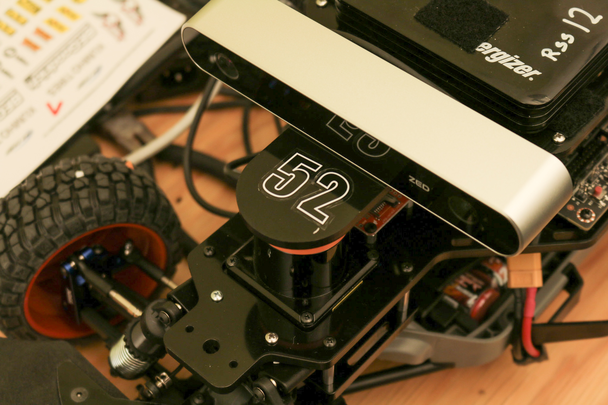
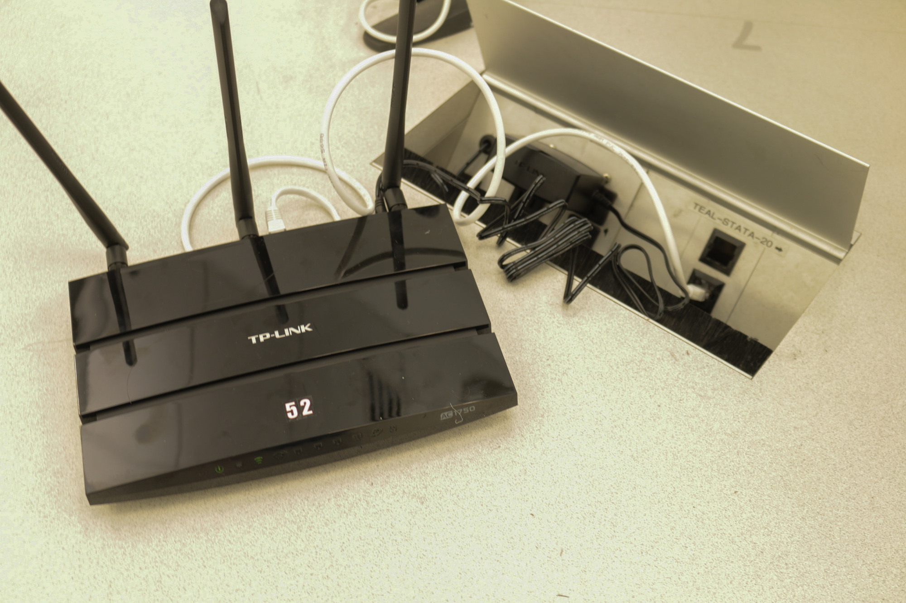
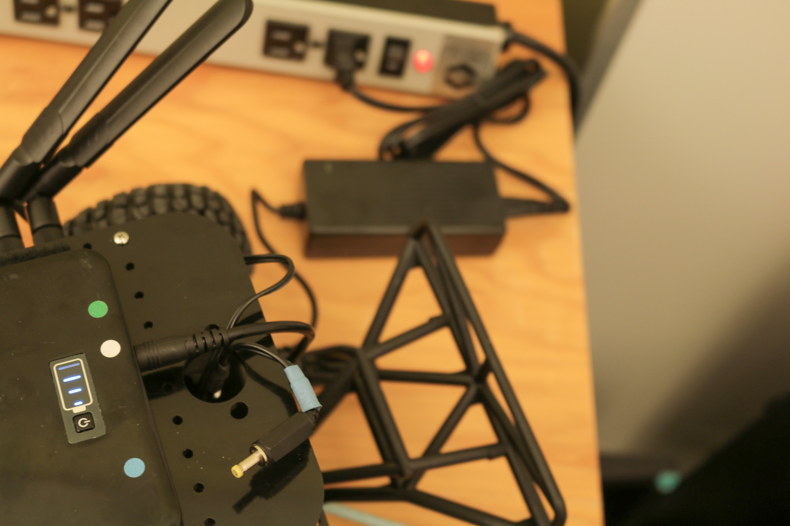
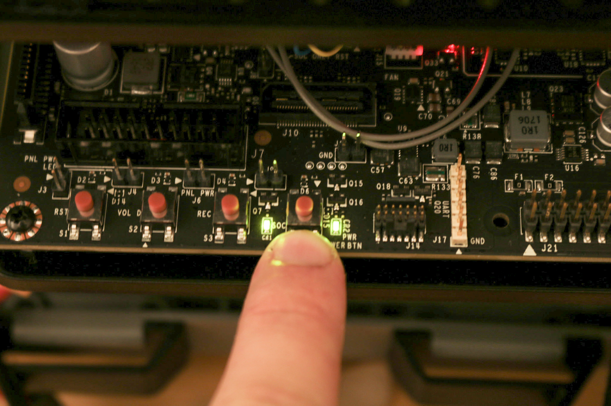
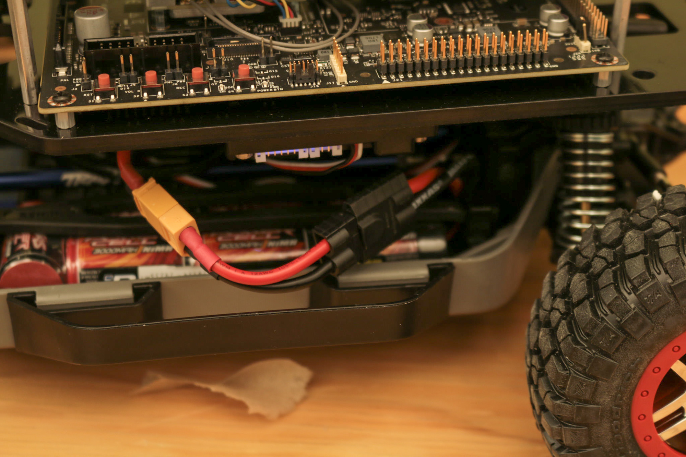

# Wall Following on the Racecar

It's time to use the actual racecar!
In this lab you will be taking the wall following code that you ran in simulation and running it on the car.
You will also be building a safety controller to prevent your racecar from crashing into obstacles.

## Disclaimer

The racecar platform is exciting and fast but it is not a toy.
The hardware we have on board
[is](https://www.amazon.com/NVIDIA-Jetson-TX2-Development-Kit/dp/B06XPFH939)
[extremely](https://www.spar3d.com/news/lidar/velodyne-cuts-vlp-16-lidar-price-4k/)
[expensive](https://www.robotshop.com/en/hokuyo-ust-10lx-scanning-laser-rangefinder.html?gclid=Cj0KCQiAq6_UBRCEARIsAHyrgUxYmgjfz734t-zWCqa2U4l7LAVsZ1_cp2CuvuD3WalcBQ9tCp2_WmMaAjbAEALw_wcB)
and it is your responsibility to keep it in good condition for future classes.
The racecar can survive a couple light bumps but if it goes flying into a wall it can be destroyed. The whole frame can split in half, the lidar can get scratched, the TX2 can get damaged, etc. Any one of these repairs can cost hundreds if not thousands of dollars.

If your car develops hardware issues for any reason, please tell the TAs and we will replace your car and then refurbish the damaged one. Most teams will probably have some sort of hardware issue throughout the course and it is typically not a big deal.
But if you damage the car in an extreme way through obviously reckless behaviour you may find yourself working on the simulated car for the rest of the course.

## Electrical Safety

The racecar runs on relatively low voltage ([≤ 20V](https://www.amazon.com/Energizer-XP18000-Universal-External-Netbooks/dp/B002K8M9HC)) so we are not too concered about dangerous shocks.
But as with any electrical system it is always important to take proper safety precautions.
For example ground yourself before touching any of the exposed circuit boards like the TX2.

## The Racecar

### Connections and Power

Once you have your car, search for its number. You can find it in two places; on top of the car's lidar and on the front of your router. The number will be in block letter stickers. If you have an older car or router there might be other numbers written or labeled on it that you can ignore.



Plug your router into an outlet and use the ethernet cable to connect it to a working ethernet port (not all the ports in 32-080 work). 
Then connect to either of these two wifi networks on your laptop using the password ```g0_fast!```:

    RACECAR_AP_[YOUR_CAR_NUMBER]
    RACECAR_AP_[YOUR_CAR_NUMBER]_5GHZ

The 5ghz network provides a faster connection but has more limited range.



Check the battery status on your racecar by pressing the power button on your black energizer battery. 
This power button is merely an indicator and does not actually power the battery on or off.
It is always on, so make sure you unplug the power cables when the car is not in use.
On the hokuyo cars the battery sits right on top of the car.
On the velodyne cars the battery is velcroed under the car (be careful when pulling it out).


If your energizer is low on battery, charge it with the adapter.
Note that the car will probably turn off when you disconnect the power adapter; during the switch back to battery power there is a moment where the TX2 does not have enough power to stay on.
You will need to disconnect the car from the power adapter when you want to drive it around.
The battery lasts a suprisingly long time, so as long as you keep the battery charged when you are not working it can last the entire lab.



Also charge your motor battery by plugging it into the charger that looks like a blue block.
Hold the start button to charge.
This battery won't last as long, especially when you are going fast, so remember to charge it when the car is not moving. The TX2 will not be affected if the motor battery gets unplugged. We have given each team two motor batteries so you can swap them out.


Connect the two power cables to the energizer battery.
One powers the lidar and the TX2. 
The other powers the USB hub (which powers the ZED camera and IMU).
If everything is receiving power, you should see LEDs light up on the TX2 and IMU and you should hear the lidar spinning (listen closely).


Power on the TX2 by pressing the rightmost button on the port side of the car labeled "power".
The button should light up green.



### SSH

With everything powered on, you can connect directly to the car using:

    ssh racecar@192.168.0.[CAR_NUMBER]
        
The password is ```racecar@mit```. If you can't connect make sure you are still on the correct Wi-Fi network.

The car is running Ubuntu.
If you do not have experience with Linux, try out some of these [basic commands](https://maker.pro/linux/tutorial/basic-linux-commands-for-beginners), but please do not delete any existing software.

### Manual Navigation

When you are ready, disconnect the power adapters to the energizer and motors and plug the motors in.



Turn on the TX2 and recconect to the racecar if necessary.
Get the car to a safe place (_not on a table!_) and run the following command:

    teleop

Now you should be able to move the car around with the joystick!
**You need press the left bumper before the car can move**
This is a known as a [Dead man's switch](https://en.wikipedia.org/wiki/Dead_man%27s_switch) and it is an easy way to stop the car from crashing - just let go of the trigger.

#### The car isn't moving

- Make sure the joystick is connected and in the right mode by running ~/joystick/test_joystick.sh
- Are you pressing the left bumper on the joystick?
- Make sure the motors are plugged in and charged. 

### Cleaning Up

Before you get too far ahead, remember that when you are done using the racecar, you **must unplug all power cables**. This includes 2 cables that connect to the energizer battery and the motor battery. Not doing this can destroy the batteries and the servo.


## Wall Following

Use ```scp``` or ```git clone``` to get one of your team members' wall following code from Lab 2 onto the car.
Just like in Lab 2 the wall follower should live in the ```src``` folder of your workspace, ```~/racecar_ws/src/[WALL_FOLLOWER_CODE]```.
```catkin_make``` in the root of your workspace to rebuild it.
Get the car into a safe location and make sure ```teleop``` is running. In another terminal launch

    roslaunch wall_follower wall_follower.launch
    
Hopefully this will work without any changes!
If nessesary, tune the parameters in the wall follower so that it works well in real life.
Combine ideas from multiple team members' implimentations of the wall follower to make a more robust controller.

Consider how to quantify how well a controller performs, and techniques to improve controller performance.

## Safety Controller

In future labs the racecar will be moving at high speeds so we need you to build a system that protects it from crashes. 

Download this lab and move the ```safety.py``` file onto the car.
You can do that by using ```scp``` (secure copy protocol):

    scp [PATH_TO_LAB]/safety.py racecar@192.168.0.[CAR_NUM]:~/racecar_ws/src

We want you to create a [node](), that listens to messages from the lidar sensor and publishes messages to the motors.
First run ```teleop``` and make sure you can move the car with the joystick.
Then, in another terminal (ssh'd into the car), run

    rostopic echo /scan
    
You should see a large quanity of text. This is the lidar data (which is massive). Press Ctrl-C to end. Talk to a TA if you don't see lidar messages.

Now we want to use that data. Open up the ```safety.py``` file which you have moved to the ```~/racecar_ws/src``` directory. You can edit files in a terminal using ```nano``` or ```vim```. In the ```__init__``` method you can see that we have set up a subscriber to the ```LIDAR_TOPIC``` (aka ```/scan```) and publisher to the ```DRIVE_TOPIC```. You can learn more about publishers and subscribers [here](http://wiki.ros.org/rospy/Overview/Publishers%20and%20Subscribers). Every time the script receives a message from ```/scan``` it passes the result to the ```callback``` function. Print this message (```msg```) and test your script by running:

    python2 ~/racecar_ws/src/safety.py
    
This should produce the same text as ```rostopic echo /scan```!

Now, we want to use this lidar message to inform us of obstacles. The ```msg``` object that you are printing is actually of type [http://docs.ros.org/api/sensor_msgs/html/msg/LaserScan.html]. See what happens if you print different entries of this datatype. For example:

    print(msg.angle_max)
    print(msg.range_max)
    ...
    
The actual lidar data (a list of depth measurements), can be found in the ```msg.ranges``` entry.
Print the minimum item of this list and run your script. Watch what happens as you move your hand in front of the lidar.

Now its time to start driving!
In the callback function, create a drive message of type [http://docs.ros.org/api/ackermann_msgs/html/msg/AckermannDriveStamped.html](AckermannDriveStamped) with the following:

    drive = AckermannDriveStamped()
    
Make the speed of this message 0 if there is an obstacle withing 0.5 meters and 1 otherwise.
Then publish the result

    self.drive_pub.publish(drive)
    
Put your car into a safe location and then run the script. Then hold the *right* bumper. The car should drive until it gets too close to an obstacle. Talk to a TA when you can do this.

__Please be careful when you are testing__. Always have your joystick ready to stop the racecar and start very slow. 

What other functionality can you program? What if when the obstacle is too close the car begins to reverse until it is a safe distance away? What if you turn the wheels of the car if there are objects close on either side? How can you make this safety controller *safe* but not *over protective*?
