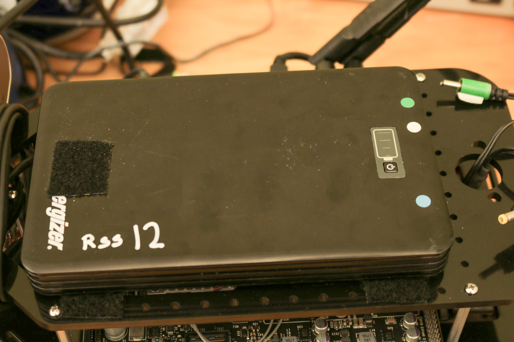
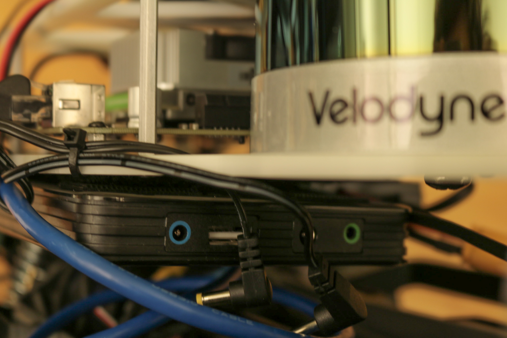
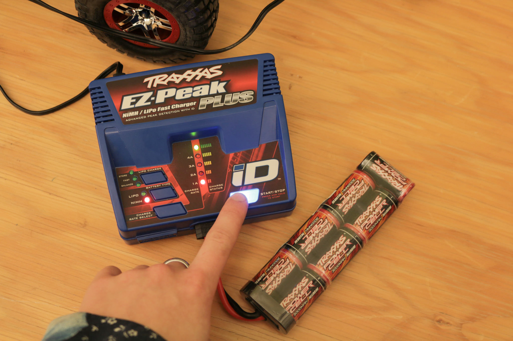
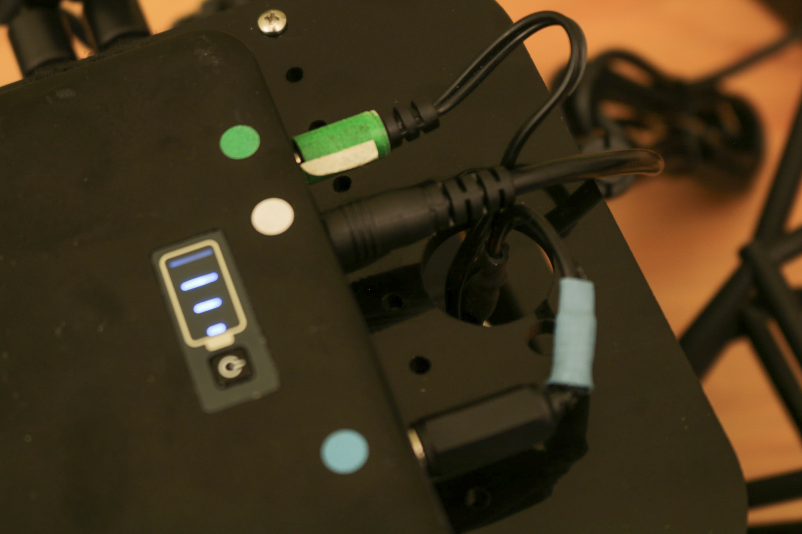
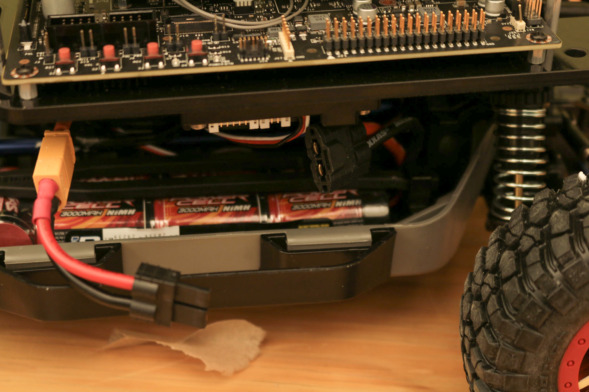
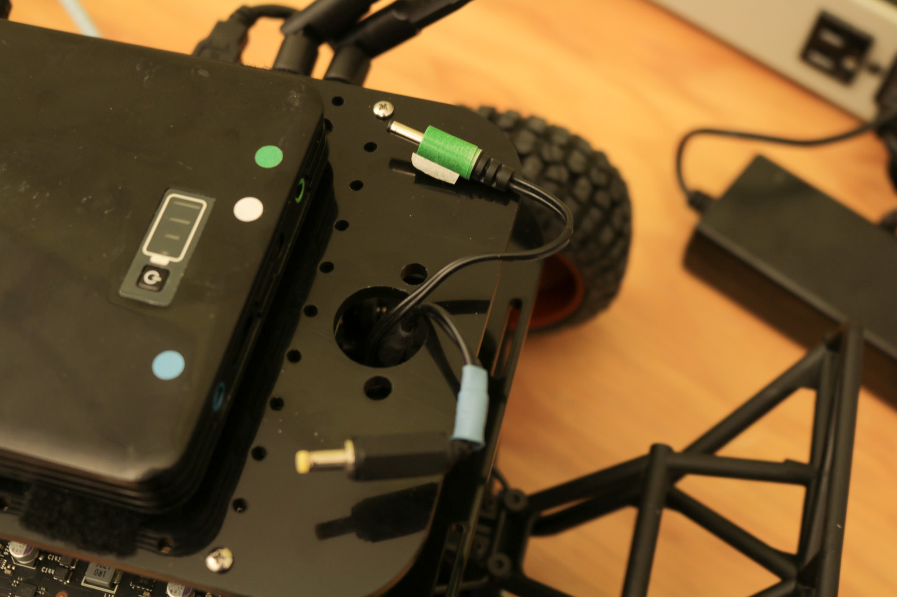

# Lab 3: Wall Following on the Racecar (In-Person)

It's time to use the actual racecar!
In this lab you will be taking the wall following code that you ran in simulation and running it on the car.
You will also be building a safety controller to prevent your racecar from crashing into obstacles.


| Lab Session   | Date  | Remote Prep | Goals |
|-------------------------|------------------------------------|------------------------------------|------------------------------------|
| 3.1   | Tuesday, March 9, 8:00-11:00 AM EST  | None |  Become familiar with the racecar platform. Access the onboard computer via SSH and connect to RViz. Drive the car with the joystick (teleoperation). Record bagfiles from teleoperation and transfer them to your local machine. |
| 3.2   | Wednesday, March 10, 8:00-11:00 AM EST  | Complete Lab 2 (wall follower working in simulation). Read about the safety controller below and create a team plan to implement it. | Install your wall follower on the racecar and tune its performance in the real world. Begin to implement and test your safety controller. |
| 3.3   | Monday, March 15, 8:00-11:00 AM EST  |  Prepare your wall follower and safety controller for deployment and data collection. |  Collect all necessary data (rosbag & video) to compile your presentation and lab report (due dates below). |

In lab on Wednesday, March 17, we will begin Lab 4.


| Deliverable   | Due Date  |
|-------------------------|------------------------------------|
| Presentation   | Wednesday, March 17 at 3:00 PM EST  |
| Lab Report     | Friday, March 19 at 1:00PM EST  on github pages site    |


## Disclaimer

The racecar platform is exciting and fast but it is not a toy.
The hardware we have on board
[is](https://www.amazon.com/NVIDIA-Jetson-TX2-Development-Kit/dp/B06XPFH939)
[extremely](https://www.spar3d.com/news/lidar/velodyne-cuts-vlp-16-lidar-price-4k/)
[expensive](https://www.robotshop.com/en/hokuyo-ust-10lx-scanning-laser-rangefinder.html?gclid=Cj0KCQiAq6_UBRCEARIsAHyrgUxYmgjfz734t-zWCqa2U4l7LAVsZ1_cp2CuvuD3WalcBQ9tCp2_WmMaAjbAEALw_wcB)
and it is your responsibility to keep it in good condition for future classes.
The racecar can survive a couple light bumps but if it goes flying into a wall it can be destroyed. The whole frame can split in half, the lidar can get scratched, the TX2 can get damaged, etc. Any one of these repairs can cost hundreds if not thousands of dollars in addition to the dozens of hours your lovely TAs put into assembling and testing them.

If your car develops hardware issues for any reason, please tell the TAs immediately and we will do our best to repair it. Most teams will probably have some sort of hardware issue throughout the course and it is typically not a big deal.
But if you damage the car in an extreme way through obviously reckless behaviour you may find yourself working on the simulated car for the rest of the course.

## COVID Safety

For Spring 2021, we ask that you observe the following procedures at Johnson Track:
- Truthfully complete your attestation on [covidpass](covidpass.mit.edu) the evening before EACH lab; also, review the MIT rules on COVID testing and ensure you are compliant. If you are denied access due to symptoms or possible exposure, let the staff know and we will make appropriate accommodations for remote work.
- Do all possible remote prep before lab (with the exception of the first lab on Tuesday), arriving ready to efficiently use your time with the real robot.
- Arrive around 8:15am at the Johnson track; labs are announced and start at 8:30 sharp. Wear a mask.
- Each team will be allocated a workspace, marked by tape on the ground; all teammates are asked to remain within their workspace during lab time except with TA permission.
- Maintain 6 feet of social distance from all others, including team members. *No sharing computers*.
- You will be given an orange cone that you can use to request help from the TAs.
- Clean your team's workspace by 10:55am.

## Electrical Safety

The racecar runs on relatively low voltage ([≤ 20V](https://www.amazon.com/Energizer-XP18000-Universal-External-Netbooks/dp/B002K8M9HC)) so we are not too concered about dangerous shocks.
But as with any electrical system it is always important to take proper safety precautions.
For example ground yourself before touching any of the exposed circuit boards like the TX2.

Please have all members of your team read and sign the electrical safety form here before starting work on the racecar:
https://eecs-ug.scripts.mit.edu:444/safety/index.py/6.141

## Tuesday, March 9: The Racecar

**Remote Preparation**: None

**Goals**: Become familiar with the racecar platform. Access the onboard computer via SSH and connect to RViz. Drive the car with the joystick (teleoperation). Record bagfiles from teleoperation and transfer them to your local machine.

### Connections and Power

Once you have your car, search for its number. You can find it in two places; on top of the car's lidar and on the front of your router. The number will be in block letter stickers. If you have an older car or router there might be other numbers written or labeled on it that you can ignore.


Plug your router into an outlet in your team's power strip. Make sure you are using the **12V power supply** that says "TP-Link" on it. **Using the other power supply will fry your router**.
Then connect to either of these two wifi networks on your laptop using the password ```g0tRACECAR?```:

    RACECAR_AP_[YOUR_CAR_NUMBER]
    RACECAR_AP_[YOUR_CAR_NUMBER]_5GHZ

The 5ghz network provides a faster connection but has more limited range.


Check the battery status on your racecar by pressing the power button on your car's primary battery.
This may be the black energizer pictured below or the grey [XTPower](https://www.amazon.com/dp/B07JJTYH8F) battery.
On the hokuyo cars the battery sits right on top of the car.
On the velodyne cars the battery is velcroed under the car (be careful when pulling it out).
(This year, all teams have received a car with a *hokyuo* lidar.)
When powered on, these batteries will remain on until power stops being drawn from them, so please remember to unplug your power cables when the car is not in use.




If your battery is low, charge it with the 18V adapter. 
Do not charge your battery while it is plugged in to the TX2.   
Please remember to charge your batteries when you are not working on the cars.   
Due to the time constraints of Johnson, we will try this year to provide backups if your battery is not charged enough to be used -- but please make an effort to arrive with battery charged.

The battery lasts a surprisingly long time, so as long as you keep the battery charged when you are not working it can last the entire lab.


Also charge your motor battery by plugging it into the charger that looks like a blue block.
Hold the start button for 2 seconds to charge - you should hear the battery fans begin to spin.
This battery won't last as long, especially when you are going fast, so remember to charge it when the car is not moving. The TX2 will not be affected if the motor battery gets unplugged. 



Connect the two power cables to the energizer/xtpower battery.
One powers the lidar and the TX2 (compute board). 
The other powers the USB hub (which powers the ZED camera and IMU).
If everything is receiving power, you should see LEDs light up on the TX2 and IMU and you should hear the lidar spinning (listen closely).



Power on the TX2 by pressing the rightmost button on the port side of the car labeled "power".
The button should light up green.


### SSH

When you're connected to the wifi with the TX2 powered on, you can connect directly to the car from your VM using:

    ssh racecar@192.168.1.[CAR_NUMBER]
        
The password is ```racecar@mit```. If you can't connect, make sure you are still on the correct Wi-Fi network.

The car is running Ubuntu just like the virtual machine.
It should be familiar, but poke around to get comfortable with the structure.
Just like in the simulator, you will often need multiple terminal windows open in order to launch different ros nodes.
There are many ways to do this through ```ssh```:

- Open multiple windows on your local machine and ```ssh racecar@192.168.1.[CAR_NUMBER]``` in each one of them. You can even ssh from multiple computers at the same time but make sure you are communicating with your team members if you do this.
- Use [tmux](https://github.com/tmux/tmux/wiki) [screen](https://kb.iu.edu/d/acuy) to open layered windows in terminal and navigate through them with key commands.
- Use ```ssh``` with the ```-X``` flag to enable X11 forwarding. With this flag you can launch graphical programs in the ```ssh``` client and have them displayed on your local machine. For example you could run ```xterm &``` to get a new terminal window. 
- Consider making bash aliases to make these steps easier.

### Manual Navigation

When you are ready, plug in your TX2 battery (energizer or XTPower) and motor battery (traxxis) in.


Turn on the TX2, and reconnect to the racecar if necessary.
Place the car on your *brick* so its wheels do not touch the ground and are free to spin.
Launch ```teleop``` just like in the simulator.
Note that if you JUST plugged in the motor battery, it takes a few minutes for the VESC to be recognized, so if you run teleop, and get the error "Failed to connect to the VESC", wait a few seconds, and try running the command again.

    teleop

Now you should be able to move the car around with the joystick!
**You need press and hold the left bumper (LB) before the car can move.**
This is a known as a [Dead man's switch](https://en.wikipedia.org/wiki/Dead_man%27s_switch) and it is an easy way to stop the car from crashing - just let go of the trigger.

#### Debugging: The car isn't moving!

- Make sure the joystick is connected and in the right mode by running `rostopic echo /vesc/joy`. When you press buttons on the joystick, you should see the messages on this topic update.
- Are you pressing and holding the left bumper on the joystick?
- Make sure the motor battery is plugged in and charged.

### RViz

Because ```rviz``` requires 3D libraries, you can't run it straight through SSH.
So you will need ```rviz``` to be connected to the car's ```roscore``` rather than the one on your local machine.
To do this first edit your ```/etc/hosts``` file on your local machine (requires ```sudo```) and add the following line:

    192.168.1.[CAR_NUMBER]     racecar
    
This essentially makes the string ```racecar``` equivalent to the IP of the car. One benefit of this is that you should now be able to SSH in to the car by running:

    ssh racecar@racecar
    
Moreover, if your username is racecar (it is in every VM), you don't need to specify the ```username@```, you can just do:

    ssh racecar
    
Now that you've set up the hostname (you only ever need to do that once), you can make ```rviz``` listen to the car's ```roscore``` by running the following command.

    export ROS_MASTER_URI=http://racecar:11311

You also need to set your own IP for 2-way communication by running:

    export ROS_IP=[YOUR_COMPUTER'S_IP]
    
You can find your IP address by running ```hostname -I``` or ```ip addr```. It should be on the 192.168.1.x subnet. **If you are on the VM you must set your network adapter to "Bridged (Autodetect)", otherwise you will not have an IP on the network.** Note that these commands need to be run in every single terminal that you want to be connected to the car's roscore, so it is worth considering making an alias for them or adding them to your ```~/.bashrc```.

Now if you run ```teleop``` on the car you should be able to open up ```rviz``` and visualize the real lidar data (topic ```/scan```) and the IMU data (```/imu/data```).

### Cleaning Up

Before you get too far ahead, remember that when you are done using the racecar, you **must unplug all power cables**. This includes 2 cables that connect to the energizer battery and the motor battery. Not doing this can destroy the batteries and the servo.





### Recording a Rosbag

With limited time on the Johnson Track, [rosbag](http://wiki.ros.org/rosbag/Commandline) will be your invaluable friend this year for compiling lab reports.

In [Lab 1C](https://github.com/mit-rss/intro_to_ros), you recorded bagfiles from the racecar simulator and inspected bagfiles recorded from the real racecar. Make sure you are comfortable with recording bagfiles on your racecar, transferring them to your local machine (try `scp`), and playing them back to analyze the data.


## Wednesday, March 10 and Monday, March 15: Wall Following


Use ```scp``` or ```git clone``` to get one of your team members' wall following code from Lab 2 onto the car.
Just like in Lab 2 the wall follower should live in the ```src``` folder of your workspace, ```~/racecar_ws/src/[WALL_FOLLOWER_CODE]```.
```catkin_make``` in the root of your workspace to rebuild it and then ```source ~/racecar_ws/devel/setup.bash```.

Before running the ```wall_follower``` change the ```drive_topic``` param to ```/vesc/ackermann_cmd_mux/input/navigation```. See the [muxes section below](https://github.com/mit-rss/wall_follower#muxes) for more details. 
Get the car into a safe location and make sure ```teleop``` is running. In another terminal launch

    roslaunch wall_follower wall_follower.launch
    
Hopefully this will work without any changes! (But it probably won't.)
To activate the wall follower, hold down the right bumper on the joystick
As necessary, tune the parameters in the wall follower so that it works well in real life.
Combine ideas from multiple team members' implementations of the wall follower to make a more robust controller.

When you are ready to test your wall follower in the testing arena, call a TA over by placing your orange cone on top of your bin!

Consider how to quantify how well a controller performs, why performance on the robot might differ from performance in the simulator, and what techniques you can use to improve your controller in deployment. Your presentation and report on Lab 3 should thoroughly address these topics.


### Some reasons it may not be working

- The number of lidar beams is different than in the simulator
- The field of view is different than in the simulator. 
- If you have a velodyne car, the lidar is not pointed forwards, it is rotated by 60 degrees.

## Wednesday, March 10 and Monday, March 15: Safety Controller

Now that you’ve got your wall follower working, we want you to build a safety controller.
In future labs, the racecar will be moving at high speeds, so we need you to build a system that protects it from crashes. 

Create a new package for your safety controller (place it in ```~/racecar_ws/src```).
Your goal is to make a node in this package that prevents the racecar from crashing into obstacles.
*The below section on Muxes will help you decide which topic your safety controller should publish to.*

We want you to be able to demonstrate that your safety controller is robust. You should be able to attempt to crash the racecar in a variety of scenarios and have the safety controller prevent the crashes. You should also be able to walk in front of the racecar without it running into you. 

At the same time, your racecar should not be "scared". You should still be able to drive close to walls, turn around corners, go fast etc. without the racecar freezing in its tracks. You will be required to run your safety controller in all future labs so don't cripple yourself with something overprotective.

__Please be careful when you are testing__. Always have your joystick ready to stop the racecar and start very slow. 

### Muxes

The racecar has a command mux with different levels of priority that you will need in building your safety controller.


The navigation topic you have been publishing to is an alias for the highest priority navigation topic in the mux ([defined here](https://github.mit.edu/2018-RSS/racecar_base_ros_install/blob/vm/racecar/racecar/launch/mux.launch)):

    /vesc/ackermann_cmd_mux/input/navigation -> /vesc/high_level/ackermann_cmd_mux/input/nav_0

For brevity we will refer to ```/vesc/high_level/ackermann_cmd_mux/input/nav_i``` as ```.../nav_i``` in this handout (_this doesn't work on the actual racecar_).
Driving commands sent to ```.../nav_0``` override driving commands sent to ```.../nav_1```, ```.../nav_2```, etc.
Likewise driving commands sent to ```.../nav_1``` override driving commands sent to ```.../nav_2```, ```.../nav_3```, etc.
You can use this structure to layer levels of control.

For example, a robot whose job it is to explore randomly and collect minerals as it finds them could use 2 muxes.
The controller that explores randomly could publish to a lower priority topic like ```.../nav_1```.
Whenever the vision system detects minerals, it could begin to publish commands to a higher priority topic like ```.../nav_0```. ```.../nav_0``` would override ```.../nav_1``` until the minerals have been depleted and commands stopped being published to```.../nav_0```.

The navigation command with the highest priority is then published to ```/vesc/high_level/ackermann_cmd_mux/output```.
This topic is then piped to ```/vesc/low_level/ackermann_cmd_mux/input/navigation``` and fed into another mux with the following priorities (from highest to lowest):

    /vesc/low_level/ackermann_cmd_mux/input/teleop
    /vesc/low_level/ackermann_cmd_mux/input/safety
    /vesc/low_level/ackermann_cmd_mux/input/navigation

```.../teleop``` is the topic that the joystick publishes to.
This will always have the highest priority.
```.../safety``` has the next highest priority. It will override anything published to ```.../navigation```. This is where your safety controller will publish.

So for your safety controller this means:

- Subscribe to ```/vesc/high_level/ackermann_cmd_mux/output``` to intercept the driving command that is being published.
- Subscribe to sensors like ```/scan```.
- Publish to ```/vesc/low_level/ackermann_cmd_mux/input/safety``` if the command being published to the navigation topic is in danger of crashing the racecar.

## Deliverables

From now on your lab deliverables will consist of two parts; a presentation and a lab report.
Make sure that in each you demonstrate your ability to 

- Log into the physical car, manually drive and visualize the laser scan.
- Autonomously drive the racecar with your wall following code.
- Prevent crashes using your safety controller while maintaining flexibility.

Use of video, screen shots, etc. is highly recommended. Make quantitative and qualitative evaluations of your results.

Create an organization for your team on [github.mit.edu](github.mit.edu) called ```rss2020-[TEAM_NUMBER]``` and make sure all of your code is pushed there. The presentation will happen a week from this lab's release on **Wednesday, March 4 during lab hours**. The lab report is due the following **Friday, March 6 at 1PM**. At this time, the TAs will pull your team's report from your website (hosted in your organization, you will learn about this next CI lecture). Please ensure that the report is complete and that you have linked to your presentation.

## RACECAR directory layout

The RACECAR comes preinstalled with most of the software you will need throughout the course. We highly recommend you keep your own software organized on the car. It's possible your car will need to be reflashed or swapped throughout the course, so it would be good if you could easily restore your code.

## ~/

### racecar_ws/src

This is where you should put your ROS modules on the car (alongside the base directory).

**racecar_ws/src/base/**

- **vesc:** motor driver wrapper code
- **racecar:** RACECAR core software architecture - muxes, launch files, etc
- **zed_ros_wrapper:** contains code for interfacing the Zed camera with ROS
- **razor\_imu\_m0\_driver:** contains code for driving the IMU

**racecar_ws/.subsystems/**

- **hokuyo**
- **imu**
- **joystick**
- **velodyne**
- **vesc**

### zed

- **compiled_samples:** precompiled binary files which use the ZED
- **zed-python:** python wrappers for direct ZED access (non-ROS wrapped), includes examples/tutorials

**NOTE:** you can run this code over SSH if you use X-Forwarding (ssh racecar@... -X)

### hokuyo

- contains hokuyo network settings, don't modify this without TA involvement

### imu

- **launch_imu.sh**: contains the launch command for the imu sensor, just for reference

### joystick

- **test_joystick.sh**: a useful shell script for debugging Joystick connections, give it a try!

### velodyne

- **launch_velodyne.sh:** contains the launch command for the velodyne sensor, just for reference

### bldc-tool

This folder contains a tool for flashing the VESC. You should not touch this without TA involvement.

### range_libc

This folder contains code for fast ray casting on the RACECAR. The package contains several ray casting methods, and is quite fast. It will be useful later on in the course (lab 5). 

See Corey's paper for more info! [https://arxiv.org/abs/1705.01167](https://arxiv.org/abs/1705.01167)

Fun fact: a (slightly more current) version of this paper was just accepted to [ICRA 2018](http://www.icra2018.org/)!

To update this code (if directed to do so), just do "git pull" in the range_libc directory, then run the below script.

- **pywrapper/compile_with_cuda.sh**: run this script if you need to recompile range_libc for any reason.
